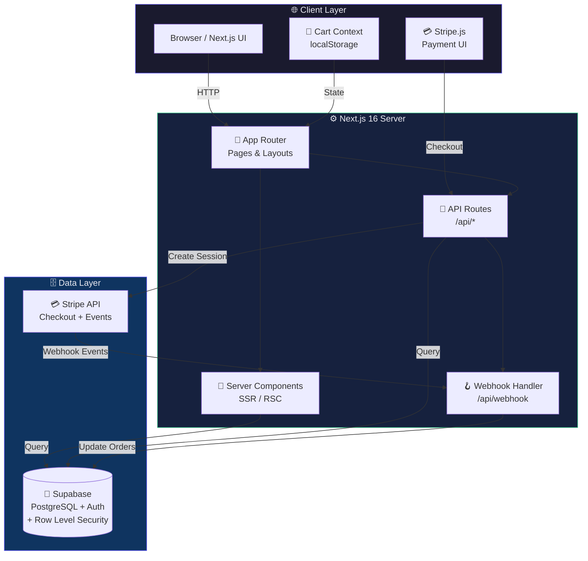
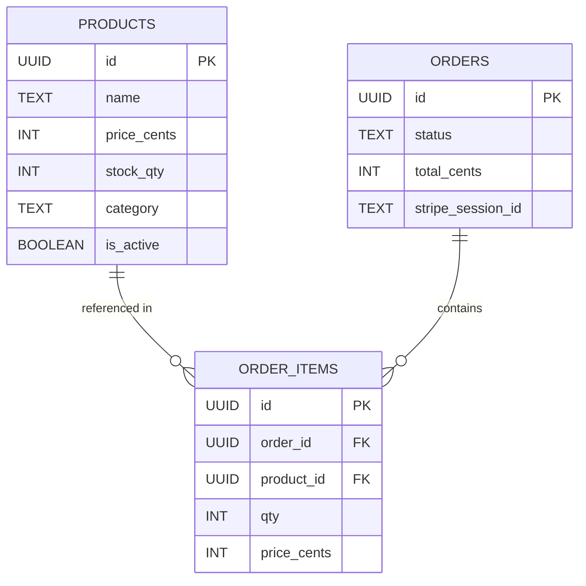

<div align="center">


<br/>

[](https://nextjs.org)
[](https://typescriptlang.org)
[](https://supabase.com)
[](https://stripe.com)
[](https://tailwindcss.com)
[](LICENSE)

<br/>

> **A modern, production-ready storefront** — shopping cart, real-time stock, Stripe checkout, and an admin dashboard, all in one repo.

<br/>

[🚀 Live Demo](#) &nbsp;·&nbsp; [📖 Getting Started](#-getting-started) &nbsp;·&nbsp; [🐛 Report Bug](https://github.com/LuthandoCandlovu/my-store/issues) &nbsp;·&nbsp; [✨ Request Feature](https://github.com/LuthandoCandlovu/my-store/issues)

</div>

<br/>

---

## 📋 Table of Contents

- [✨ Features](#-features)
- [🏗️ Architecture](#️-architecture)
- [🗄️ Database Schema](#️-database-schema)
- [🗺️ Route Map](#️-route-map)
- [📁 Project Structure](#-project-structure)
- [🏁 Getting Started](#-getting-started)
- [🔑 Environment Variables](#-environment-variables)
- [🚢 Deployment](#-deployment)
- [🤝 Contributing](#-contributing)

---

## ✨ Features

<div align="center">

| &nbsp; | Feature | Description |
|:---:|:---|:---|
| 🛒 | **Shopping Cart** | Persistent cart with localStorage — add, remove, update quantities across sessions |
| 💳 | **Stripe Payments** | Secure Stripe Checkout with full webhook lifecycle event handling |
| 📦 | **Live Stock** | Real-time inventory with automatic stock deduction on every purchase |
| 👑 | **Admin Dashboard** | Manage products, view orders, and update stock from a protected panel |
| 🎨 | **Beautiful UI** | Tailwind CSS with responsive, mobile-first design using Headless UI & Radix |
| 🔐 | **Auth Ready** | Supabase Auth with login/register pages included out of the box |
| 🛡️ | **Row Level Security** | Fine-grained data access control enforced at the Supabase database level |
| ⚡ | **Server Components** | Next.js 16 App Router with RSC for optimal performance and SEO |

</div>

---

## 🏗️ Architecture



<br/>

### 🔧 Tech Stack

<div align="center">

<table>
<tr>
<th align="center" width="25%">⚛️ Frontend</th>
<th align="center" width="25%">🗄️ Backend</th>
<th align="center" width="25%">💳 Payments</th>
<th align="center" width="25%">🔄 State</th>
</tr>
<tr>
<td valign="top" align="center">

Next.js 16<br/>App Router<br/>TypeScript 5<br/>Tailwind CSS<br/>Headless UI<br/>Radix UI<br/>Lucide Icons

</td>
<td valign="top" align="center">

Supabase<br/>PostgreSQL<br/>Supabase Auth<br/>Row Level Security<br/>Server Components

</td>
<td valign="top" align="center">

Stripe Checkout<br/>Stripe Webhooks<br/>Payment lifecycle<br/>Idempotency keys<br/>Secure flow

</td>
<td valign="top" align="center">

React Context<br/>localStorage persist<br/>Server Components<br/>No Redux needed<br/>useCart hook

</td>
</tr>
</table>

</div>

---

## 🗄️ Database Schema



<details>
<summary><strong>📄 View full SQL setup</strong></summary>

<br/>

```sql
-- ──────────────────────────────────────────────────
-- 1. Products
-- ──────────────────────────────────────────────────
CREATE TABLE products (
    id          UUID    PRIMARY KEY DEFAULT gen_random_uuid(),
    name        TEXT    NOT NULL,
    price_cents INT     NOT NULL,
    stock_qty   INT     NOT NULL,
    category    TEXT,
    is_active   BOOLEAN DEFAULT true
);

-- ──────────────────────────────────────────────────
-- 2. Orders
-- ──────────────────────────────────────────────────
CREATE TABLE orders (
    id                UUID PRIMARY KEY DEFAULT gen_random_uuid(),
    status            TEXT DEFAULT 'pending',
    total_cents       INT  NOT NULL,
    stripe_session_id TEXT UNIQUE
);

-- ──────────────────────────────────────────────────
-- 3. Order Items (join table)
-- ──────────────────────────────────────────────────
CREATE TABLE order_items (
    id          UUID PRIMARY KEY DEFAULT gen_random_uuid(),
    order_id    UUID REFERENCES orders(id)   ON DELETE CASCADE,
    product_id  UUID REFERENCES products(id) ON DELETE RESTRICT,
    qty         INT NOT NULL,
    price_cents INT NOT NULL
);

-- ──────────────────────────────────────────────────
-- 4. Row Level Security
-- ──────────────────────────────────────────────────
ALTER TABLE products    ENABLE ROW LEVEL SECURITY;
ALTER TABLE orders      ENABLE ROW LEVEL SECURITY;
ALTER TABLE order_items ENABLE ROW LEVEL SECURITY;

-- Public can read active products
CREATE POLICY "Public read products"
    ON products FOR SELECT USING (is_active = true);
```

</details>

---

## 🗺️ Route Map

```
my-store/
│
├── /                        🏠  Homepage — hero + featured products
├── /menu                    🛍️  Product catalog with category filter
├── /product/[id]            📄  Product detail + add to cart
├── /cart                    🛒  Cart review + Stripe checkout
│
├── /checkout/
│   ├── success              ✅  Order confirmation
│   └── cancel               ❌  Payment cancelled fallback
│
└── /admin/
    ├── (index)              📊  Dashboard overview
    └── products             📦  Product & inventory management
```

---

## 📁 Project Structure

```
my-store/
├── 📁 app/                          # Next.js App Router root
│   ├── 📁 (shop)/                   # Public store routes
│   │   ├── page.tsx                 # / Homepage
│   │   ├── 📁 menu/                 # /menu catalog
│   │   ├── 📁 product/[id]/         # /product/:id dynamic page
│   │   └── 📁 cart/                 # /cart
│   ├── 📁 checkout/
│   │   ├── 📁 success/              # /checkout/success
│   │   └── 📁 cancel/               # /checkout/cancel
│   ├── 📁 admin/                    # Protected admin area
│   │   ├── page.tsx                 # /admin dashboard
│   │   └── 📁 products/             # /admin/products
│   └── 📁 api/
│       ├── 📁 checkout/             # POST — create Stripe session
│       └── 📁 webhook/              # POST — handle Stripe events
│
├── 📁 components/
│   ├── 📁 shop/                     # ProductCard, CartItem, Filters…
│   ├── 📁 admin/                    # AdminTable, StockEditor…
│   └── 📁 shared/                   # Navbar, Button, Modal…
│
├── 📁 contexts/
│   └── CartContext.tsx              # Global cart state + localStorage
│
├── 📁 lib/
│   └── 📁 supabase/
│       ├── client.ts                # Browser Supabase client
│       └── server.ts                # Server-side Supabase client
│
├── 📁 hooks/                        # useCart, useProducts, useAdmin…
├── 📁 scripts/
│   └── supabase-setup.sql          # ⭐ Run this first!
└── 📁 public/                       # Static assets
```

---

## 🏁 Getting Started

### Prerequisites

| Tool | Version | Link |
|:---|:---|:---|
| Node.js | 18+ | [nodejs.org](https://nodejs.org) |
| Supabase account | Free tier | [supabase.com](https://supabase.com) |
| Stripe account | Free test mode | [stripe.com](https://stripe.com) |

### Installation

**1️⃣ Clone the repo**

```bash
git clone https://github.com/LuthandoCandlovu/my-store.git
cd my-store
```

**2️⃣ Install dependencies**

```bash
npm install
```

**3️⃣ Configure environment variables**

```bash
cp .env.example .env.local
# Fill in your Supabase and Stripe keys — see below
```

**4️⃣ Set up the database**

Open your [Supabase SQL Editor](https://app.supabase.com), paste the contents of `scripts/supabase-setup.sql`, and run it.

**5️⃣ Start the development server**

```bash
npm run dev
```

**6️⃣ Open your store**

```
http://localhost:3000/menu
```

> 🧪 **Connection check** → `http://localhost:3000/menu/debug`

---

## 🔑 Environment Variables

```env
# ── Supabase ────────────────────────────────────────────
NEXT_PUBLIC_SUPABASE_URL=https://xxxxxxxxxxxx.supabase.co
NEXT_PUBLIC_SUPABASE_ANON_KEY=eyJh...
SUPABASE_SERVICE_ROLE_KEY=eyJh...

# ── Stripe ──────────────────────────────────────────────
NEXT_PUBLIC_STRIPE_PUBLISHABLE_KEY=pk_test_...
STRIPE_SECRET_KEY=sk_test_...
STRIPE_WEBHOOK_SECRET=whsec_...

# ── App ─────────────────────────────────────────────────
NEXT_PUBLIC_SITE_URL=http://localhost:3000
```

> ⚠️ **Never commit `.env.local`** — it is already included in `.gitignore`.

---

## 🚢 Deployment

### Deploy to Vercel *(Recommended)*

[](https://vercel.com/new/clone?repository-url=https://github.com/LuthandoCandlovu/my-store)

1. Push your code to GitHub
2. Import the project at [vercel.com](https://vercel.com)
3. Add your **production** environment variables in the Vercel dashboard
4. Hit **Deploy** 🎉

**Production keys** — swap test for live:

```env
NEXT_PUBLIC_STRIPE_PUBLISHABLE_KEY=pk_live_...
STRIPE_SECRET_KEY=sk_live_...
STRIPE_WEBHOOK_SECRET=whsec_...
NEXT_PUBLIC_SITE_URL=https://your-domain.com
```

> 📌 Register `https://your-domain.com/api/webhook` as a live endpoint in your [Stripe Dashboard](https://dashboard.stripe.com/webhooks).

---

## 🤝 Contributing

Contributions are welcome and appreciated!

```bash
# 1. Fork the repo on GitHub

# 2. Create your feature branch
git checkout -b feature/amazing-feature

# 3. Commit your changes  (Conventional Commits style)
git commit -m "feat: add amazing feature"

# 4. Push to GitHub
git push origin feature/amazing-feature

# 5. Open a Pull Request
```

---

## 📝 License

Distributed under the **MIT License** — see [`LICENSE`](LICENSE) for details.

---

## 🙏 Acknowledgements

- [Next.js Docs](https://nextjs.org/docs)
- [Supabase Docs](https://supabase.com/docs)
- [Stripe Docs](https://stripe.com/docs)
- [Tailwind CSS](https://tailwindcss.com)
- [Capsule Render](https://github.com/kyechan99/capsule-render) for the animated banners

---

<div align="center">


**Built with ❤️ by [Luthando Candlovu](https://github.com/LuthandoCandlovu)**

⭐ **Star this repo** if you found it helpful!

</div>
