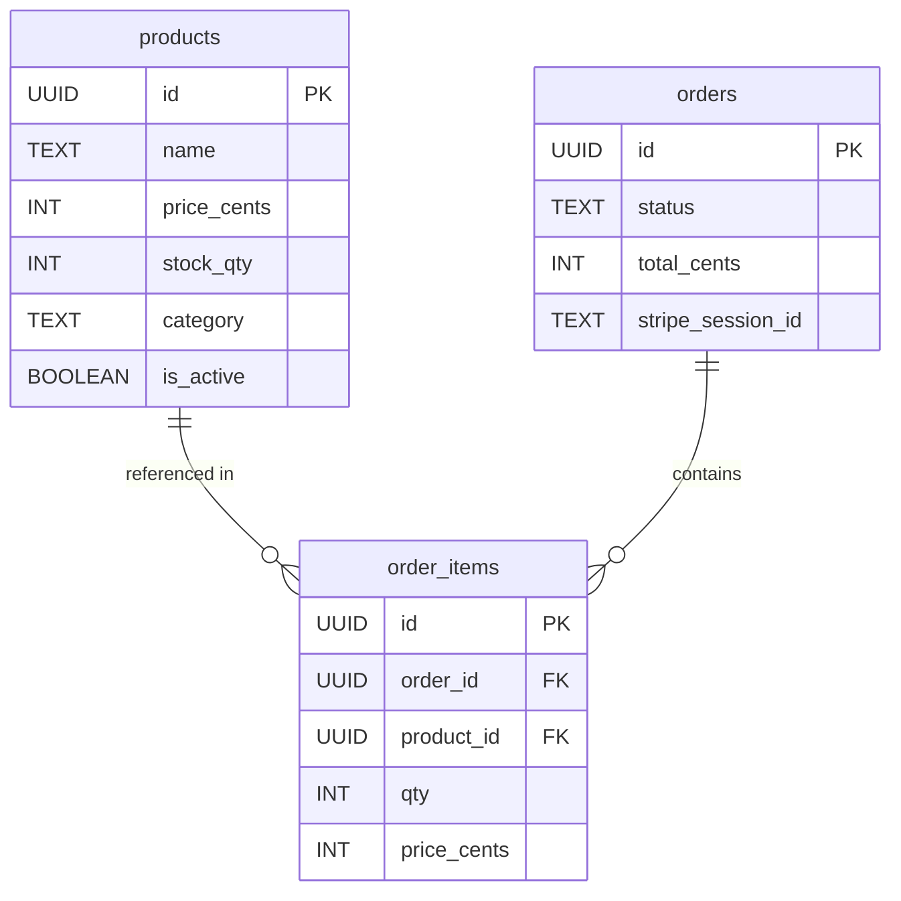

<div align="center">

# 🛍️ MyStore

### Full-Stack E-Commerce Platform


A modern, production-ready e-commerce store built with **Next.js 16**, **Supabase**, and **Stripe**. Features a beautiful UI, shopping cart, real-time stock management, and secure payments.

[🚀 Live Demo](#) · [📖 Docs](#getting-started) · [🐛 Report Bug](https://github.com/LuthandoCandlovu/my-store/issues) · [✨ Request Feature](https://github.com/LuthandoCandlovu/my-store/issues)

</div>

---

## 📋 Table of Contents

- [✨ Features](#-features)
- [🚀 Tech Stack](#-tech-stack)
- [🗄️ Database Schema](#️-database-schema--erd)
- [🏁 Getting Started](#-getting-started)
- [🔑 Environment Variables](#-environment-variables)
- [🗺️ Pages Overview](#️-pages-overview)
- [📁 Project Structure](#-project-structure)
- [🚢 Deployment](#-deployment)
- [🤝 Contributing](#-contributing)
- [📧 Contact](#-contact)

---

## ✨ Features

| Feature | Description |
|---|---|
| 🛒 **Shopping Cart** | Persistent cart with localStorage, add/remove items, quantity updates |
| 💳 **Stripe Payments** | Secure checkout integration with webhook handling |
| 📦 **Live Stock** | Real-time inventory management with automatic stock reduction |
| 👑 **Admin Dashboard** | Manage products, view orders, update stock levels |
| 🎨 **Beautiful UI** | Tailwind CSS with responsive design for mobile & desktop |
| 🔐 **Authentication** | Supabase Auth ready (login/register pages included) |
| 📱 **Mobile First** | Fully responsive design that works on all devices |
| 🛡️ **Row Level Security** | Supabase RLS policies for fine-grained data access control |

---

## 🚀 Tech Stack

<table>
<tr>
<td valign="top" width="25%">

**Frontend**
- Next.js 16 (App Router)
- TypeScript
- Tailwind CSS
- Headless UI + Radix
- Lucide Icons

</td>
<td valign="top" width="25%">

**Backend**
- Supabase (PostgreSQL)
- Supabase Auth
- Row Level Security
- Server Components

</td>
<td valign="top" width="25%">

**Payments**
- Stripe Checkout
- Stripe Webhooks
- Secure payment flow

</td>
<td valign="top" width="25%">

**State Management**
- React Context (Cart)
- localStorage persistence
- Server Components

</td>
</tr>
</table>

---

## 🗄️ Database Schema — ERD



### SQL Setup

```sql
-- Products table
CREATE TABLE products (
    id UUID PRIMARY KEY,
    name TEXT NOT NULL,
    price_cents INT NOT NULL,
    stock_qty INT NOT NULL,
    category TEXT,
    is_active BOOLEAN DEFAULT true
);

-- Orders table
CREATE TABLE orders (
    id UUID PRIMARY KEY,
    status TEXT DEFAULT 'pending',
    total_cents INT NOT NULL,
    stripe_session_id TEXT UNIQUE
);

-- Order items table
CREATE TABLE order_items (
    id UUID PRIMARY KEY,
    order_id UUID REFERENCES orders(id),
    product_id UUID REFERENCES products(id),
    qty INT NOT NULL,
    price_cents INT NOT NULL
);
```

---

## 🏁 Getting Started

### Prerequisites

- Node.js 18+
- npm or yarn
- [Supabase account](https://supabase.com) (free)
- [Stripe account](https://stripe.com) (free)

### Installation

**1. Clone the repository**
```bash
git clone https://github.com/LuthandoCandlovu/my-store.git
cd my-store
```

**2. Install dependencies**
```bash
npm install
```

**3. Set up environment variables**

Create a `.env.local` file in the root directory (see [Environment Variables](#-environment-variables) below).

**4. Set up the database**

Run the SQL in `scripts/supabase-setup.sql` in your Supabase SQL editor.

**5. Start the development server**
```bash
npm run dev
```

**6. Open your store**
```
http://localhost:3000/menu
```

---

## 🔑 Environment Variables

Create a `.env.local` file in the project root:

```env
# Supabase
NEXT_PUBLIC_SUPABASE_URL=your_supabase_url
NEXT_PUBLIC_SUPABASE_ANON_KEY=your_supabase_anon_key
SUPABASE_SERVICE_ROLE_KEY=your_supabase_service_role_key

# Stripe
NEXT_PUBLIC_STRIPE_PUBLISHABLE_KEY=your_stripe_publishable_key
STRIPE_SECRET_KEY=your_stripe_secret_key
STRIPE_WEBHOOK_SECRET=your_stripe_webhook_secret

# App
NEXT_PUBLIC_SITE_URL=http://localhost:3000
```

> ⚠️ **Never commit your `.env.local` file to version control.** Make sure it's listed in `.gitignore`.

---

## 🗺️ Pages Overview

| Route | Description |
|---|---|
| `/` | Homepage with hero and featured products |
| `/menu` | Browse all products with categories |
| `/product/[id]` | Individual product details |
| `/cart` | Shopping cart with checkout |
| `/checkout/success` | Order confirmation |
| `/checkout/cancel` | Payment cancelled |
| `/admin` | Dashboard for store management |
| `/admin/products` | Manage product inventory |

---

## 📁 Project Structure

```
my-store/
├── app/                    # Next.js App Router
│   ├── (shop)/             # Public pages
│   ├── admin/              # Admin dashboard
│   └── api/                # API routes
├── components/
│   ├── shop/               # Store components
│   ├── admin/              # Admin components
│   └── shared/             # Reusable components
├── contexts/               # React Context (Cart, etc.)
├── lib/
│   └── supabase/           # Supabase client helpers
├── hooks/                  # Custom React hooks
├── scripts/                # Database setup scripts
└── public/                 # Static assets
```

---

## 🚢 Deployment

### Deploy to Vercel (Recommended)

1. Push your code to GitHub
2. Import the project at [vercel.com](https://vercel.com)
3. Add your production environment variables in the Vercel dashboard
4. Hit **Deploy** 🎉

### Production Environment Variables

Update `.env.local` values with your live/production keys:

```env
NEXT_PUBLIC_SUPABASE_URL=your_production_url
NEXT_PUBLIC_SUPABASE_ANON_KEY=your_production_anon_key
SUPABASE_SERVICE_ROLE_KEY=your_production_service_key
NEXT_PUBLIC_STRIPE_PUBLISHABLE_KEY=pk_live_...
STRIPE_SECRET_KEY=sk_live_...
STRIPE_WEBHOOK_SECRET=whsec_...
NEXT_PUBLIC_SITE_URL=https://your-domain.com
```

---

## 🧪 Testing

Run the debug page to verify Supabase connection:
```
http://localhost:3000/menu/debug
```

Test the API directly:
```bash
curl -X GET "https://your-project.supabase.co/rest/v1/products" \
  -H "apikey: your_anon_key" \
  -H "Authorization: Bearer your_anon_key"
```

---

## 🤝 Contributing

Contributions are welcome! Please follow the steps below:

1. **Fork** the repository
2. **Create** your feature branch
   ```bash
   git checkout -b feature/AmazingFeature
   ```
3. **Commit** your changes
   ```bash
   git commit -m 'Add some AmazingFeature'
   ```
4. **Push** to the branch
   ```bash
   git push origin feature/AmazingFeature
   ```
5. **Open** a Pull Request

---

## 📝 License

This project is licensed under the **MIT License** — see the [LICENSE](LICENSE) file for details.

---

## 🙏 Acknowledgments

- [Next.js Documentation](https://nextjs.org/docs)
- [Supabase Documentation](https://supabase.com/docs)
- [Stripe Documentation](https://stripe.com/docs)
- [Tailwind CSS](https://tailwindcss.com)

---

## 📧 Contact

**Luthando Candlovu** — [@LuthandoCandlovu](https://github.com/LuthandoCandlovu)

Project Link: [https://github.com/LuthandoCandlovu/my-store](https://github.com/LuthandoCandlovu/my-store)

---

<div align="center">
  Built with ❤️ using Next.js, Supabase, and Stripe
</div>
